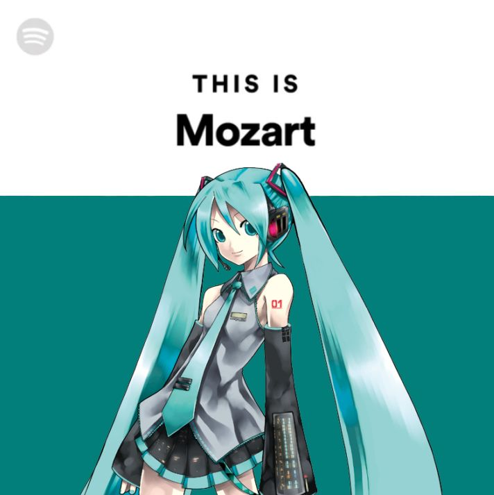

<div align="center">

# CHÀO AE! | WELCOME, MY FRIENDS! | いらっしゃいませ！

</div>


*Background image: Drawn by [Konya Karasue](https://www.pixiv.net/en/users/10109777).*

[](https://git.io/typing-svg)


<div align="center">

</div>

> [!NOTE]
>  Some of these READMEs (in text) are outdated. The updated ones are higlighted bold!

> *I love this world 'cause it has you.*

Beautiful, right?

Looking at my desktop today, I still cannot believe that **a year ago** (March 2025), I was still struggling and scared to open my laptop's BIOS. The best I could do at "ricing" my Windows 11 was installing Windhawk, Rainmeter and Wallpaper Engine (Horrible performance, of course).

The day I made my first bootable USB and installed Fedora Linux 42 (KDE Plasma) into my poor laptop has changed my life. In a good way. And nowadays, I feel proud enough (I do not mean I'm good enough) to make a GitHub account and share my ricing process here.

*(I am still a newbie, so please be easy on me :) I will make my own code in the near future, and I guarantee you it will be absolute dogshit!! :proud:)*


<div align="center">
   
## 🖥️FASTFETCH TIME!!!
</div>

<div align="center">

```
         ┌─────────────────────────────────────────────────────────────┐
         │    >fastfetch                                               │
         │                                                             │
         │         /\              ShotChannel@archlinux               │
         │        /  \             ----------------------------        │
         │       /\  /\            PC       LENOVO IdeaPad Slim 5      │
         │      /  \/  \           OS       Arch Linux x86_64 (btw)    │
         │     / /\  /\ \          WM       Hyprland                   │
         │    /_/  \/  \_\         Terminal Kitty                      │
         │                         Shell    Fish                       │
         │                         Editor   Zed + NeoVim               │
         │                         Bar      Waybar + EWW               │
         │                         Music    Hatsune Miku               │
                           │                         Uptime   2 baths away               │                  
         └─────────────────────────────────────────────────────────────┘
```


</div>


<div align="center">
   
## ❓Anyways, Q&A !!

*(Or, I question and answer myself because literally no one cares about this...)*

<table>
<tr>
<td>

<details>
<summary><b>1. Are you really into coding?</b></summary>
   
*No, I'm not :) I am more into graphic design. Honestly, if I were never using Linux, I would never do all of these.*\

**Update: Now I am actually into coding :))) I saw that Computer Science, in general, is going to earn me a brighter career and a higher chance for success than Graphic Design. I'm learning a little of drawing tho...**
</details>

<details>
<summary><b>2. Why did you choose Fedora Linux as your first distro?</b></summary>

*I asked a friend on Discord, and he just randomly picked me one of the famous distros, which is Fedora (lol).*\
*The funny thing is, after I've used Fedora for a while, I did a test on [Distro Chooser](distrochooser.de), and after the test, the no.1 distro recommendation was Fedora!*\
*It's like *fate* has already chosen the distro for me. And I absolutely love it.*

**Update: I am now using Arch Linux (btw).**
**Why? Both Fedora itself and I made some silly mistakes, and as a consequence, Fedora corrupted all of my passwords, including su's password, and I wiped all of my computer partitions.**
**Thank you, Fedora Linux. It was very fun. Screw you tho, SELinux.**
</details>

<details>
<summary><b>2.1. Why did you choose Arch Linux as your current distro?</b></summary>

**Most because of how lightweight it is. Pacman and AUR are awesome. And last but not least, I am advanced enough to deal with Arch (I installed Arch manually btw).**
</details>

<details>
<summary><b>3. Why did you choose KDE Plasma as your first Desktop Environment (DE)?</b></summary>

*I do acknowledge the flexibility of the Window Manager (WM), but KDE Plasma has already done 99% of the things that I need and can be done in a WM. For example, the Plasma panel with the [Plasma Panel Colorizer widget](https://github.com/luisbocanegra/plasma-panel-colorizer) is a very good alternative to [Waybar](https://github.com/Alexays/Waybar?tab=readme-ov-file); or the script [Krohnkite](https://github.com/esjeon/krohnkite) can make KDE Plasma a tiling desktop like Hyprland or i3.*\
*It's not an exaggeration to say that using KDE Plasma is the closest experience to using a WM.*

**Update: I am using Hyprland now. And it is not as hard as I thought. And it IS amazing!**
</details>

<details>
<summary><b>3.1. Why did you choose Hyprland as your current Window Manager (WM)?</b></summary>

**It has a lot of pre-configured dotfiles, so I can actually learn and use it at the same time. Hyprland's configs are pretty straightforward, so there is not really any hiccup switching from graphical settings to editing plain text. And as I said, I was amazed by how lightweight, flexible and powerful a WM can be.**
</details>

<details>
<summary><b>4. Gam-</b></summary>

Counter-Strike; Geometry Dash; Project DIVA; Project SEKAI.
</details>
</td>
</tr>
</table>
</div>


<div align="center">
   
## 🎮📊 Some of my stats !! 
   


<br>


</div>

- <b>Counter-Strike 2</b>: > **1500** hours played, Faceit lvl.4 (Peak), 6500 ELO Premier (Peak).
- <b>Geometry Dash</b>: Hardest Demon: [Windy Landscape by Woogi (Insane Demon)](https://www.youtube.com/watch?v=sTBN3K_c9eQ).
- <b>Project DIVA</b>: Hardest: Ievan Polkka (EXTREME 8*).
- <b>Project SEKAI</b>: Hardest: JINSEI (EXPERT 31*).
- <b>Coding experience</b>: None XD
- <b>Experience with girls</b>: None XD (**Update: Now I do (I still cannot believe this)) :)) Life is funny, unpredictable and nice at the same time XD**)
**LINUX USERS CAN FIND LOVE!!!11!**

<div align="center">
   
[](https://github.com/ashutosh00710/github-readme-activity-graph)

</div>

### Truly a gamer, right? XD


<div align="center">
   
# That's all! Thanks for reading all of this bullshit :D
</div>

<div align="center">
Now you can check my repo :3
<br>
   




`wow, you actually read it all :3`
</div>
